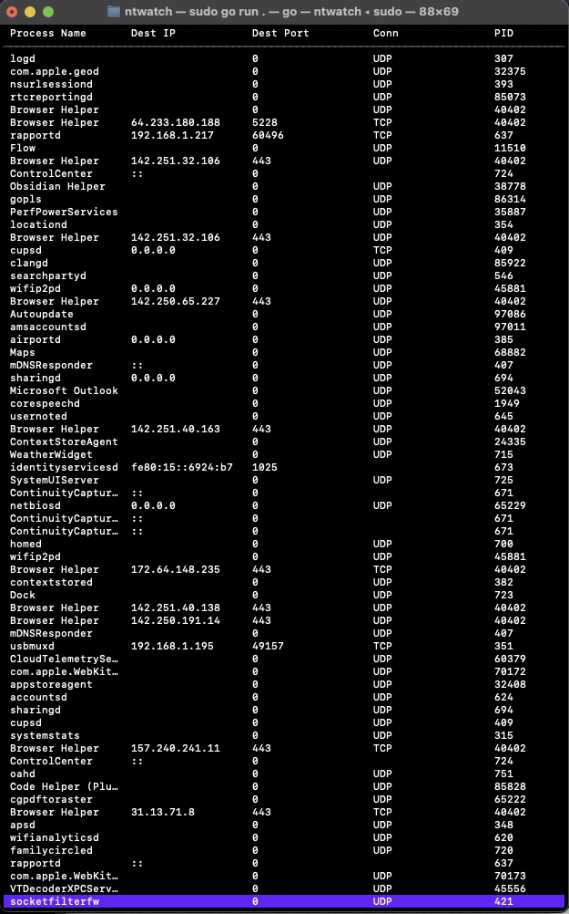

## ntwatch
a better version of netstat and nettop which 
1. has a cleaner tui
2. includes information on associated proccesses through libproc

the goal is to create a mix between nettop and wireshark, while keeping it simple as nettop and making it more for 
a security overview rather than in depth testing.

v1
    does have
        - information about sockets
        - a clean(ish) tui with bubbletea
        - both packet and socket functionality
    does not have
        - live updating
        - visual representation of sockets connected to packets

    
    