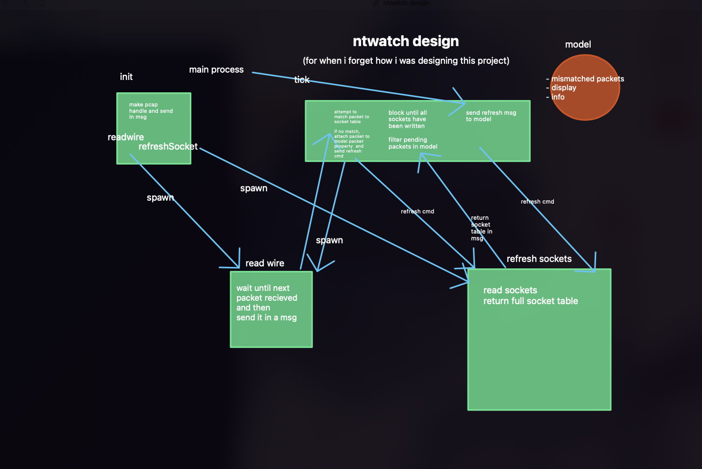

# ntwatch
a golang bubbletea tui that reads in and connects sockets and processes, read in from the source.

## summary 
1. brings over socket information previously only available in undocumented C MacOS system libraries (libproc.c) to Go, in a much more readable format (done before, but not to this extent)

2. displays that socket information in a Bubbletea TUI in a way that a non-technical person can understand and a technical person can appreciate

It's the baby of nettop and wireshark - a tui that shows network flows in a minimal way that prioritizes graphically showing what the computer is doing, without overloading the ui with excessive detail (the way nettop does). I started off making this project because it annoyed me that wireshark didnt' show the processes that were recieving packets, and nettop's ui was ugly and hard to discern broader processes/network processes from. 
While the project isn't completely done and flesh with features, the backend and socket/packet tracking is done, which is the hardest part. The bubbletea UI is proof of that, which is a tui that shows apps that are communicating with external ips in real time.

## design

### backend

The first part I worked on was getting socket information and being able to access it in go. I didn't want to use lsof, but I wanted the same functionality. This is mostly done in ex_ppi.c, which uses functions from libproc.h, a header file hidden in xcode's C sdks. The only documentation I had was proc_info.h, which is an extremely stripped down and un-commented file with the structs returned by functions in libproc.h, with six-letter abbreviations for values that were extremely hard to discern. Once I had c functions reliably returning structs describing socket information for each process (similar to what you'd do on the /proc folder on linux), I used CGO to use those c functions in Go (cgo.go, c_defs.go, c_files/bridge.h, etc). That alone accomplished my first objective of bringing socket information to Go without using an external binary (lsof). I also brought along process information - pids  process names, ports, etc.

### frontend

I then started working on the frontend - a bubbletea GUI that prioritizes getting in packets and all other functionality after. I didn't want to drop any packets. After they were recieved, they should be matched to a list of running processes and their ports. If a match wasn't found, then the process list should be refreshed. Each green rectangle above is a seperate go process, ran by bubbletea's commands, and inter-thread communication happens through bubbletea's messages. 

## demo
v1.0

speaks for itself - the first version of ntwatch! fully done!
- matches packets to sockets
- illustrates all network flows in a bubbletea gui
   

submitted for the athena award badge! 

